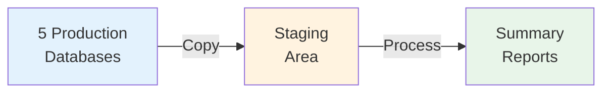
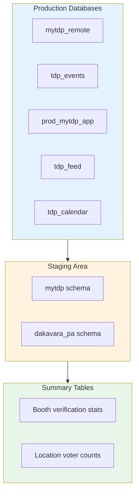

# Data Sync Service

> **ETL pipeline that syncs data from production databases and creates summary reports.**

## What This System Does



**Simple explanation:**
1. **Copy** data from 5 production databases
2. **Combine** related data into one place
3. **Summarize** into easy-to-read reports

---

## Quick Start

```bash
# Start databases
docker compose up -d

# Run pipeline
python3 main.py --local
```

---

## Documentation

### For Everyone

| Document | Description |
|----------|-------------|
| [**Architecture**](docs/ARCHITECTURE.md) | How the system works (with diagrams) |
| [**SIR Domain**](docs/SIR_DOMAIN.md) | Voter verification tracking example |

### For Developers

| Document | Description |
|----------|-------------|
| [**Adding Transforms**](docs/ADDING_TRANSFORMS.md) | How to add new features |
| [**Technical Details**](docs/TECHNICAL.md) | Deep dive for developers |

---

## How It Works



---

## Key Features

### 1. Efficient Data Sync
- Only copies what changed (not entire database)
- Handles millions of records efficiently

### 2. Smart Denormalization
- Combines related data ONCE (not multiple times)
- Makes queries fast and efficient

### 3. Real-time Reports
- Booth verification stats
- Active user stats
- Location voter counts

---

## Project Structure

```
src/
├── extract/      # Copy data from production
├── transform/    # Process and summarize
├── load/         # Save to database
└── shared/       # Common utilities
```

---

## Commands

```bash
# Local development
python3 main.py --local

# Production
python3 main.py
```

---

## Learn More

- [**Architecture**](docs/ARCHITECTURE.md) — Detailed system design
- [**SIR Domain**](docs/SIR_DOMAIN.md) — Voter verification example
- [**Adding Transforms**](docs/ADDING_TRANSFORMS.md) — Developer guide
