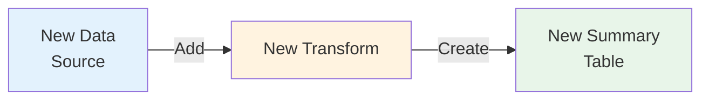

# Adding New Features (Transforms)

## Overview



**To add a new feature:**
1. Create a handler directory
2. Add config and handler files
3. Create transform files
4. Create destination table
5. Run — auto-discovered!

---

## Directory Structure

```
src/
├── extract/              # CDC extraction layer
├── transform/            # Transform layer
│   ├── base.py           # TransformHandler + TransformHelper
│   ├── registry.py       # Auto-discovers handlers
│   ├── orchestrator.py   # Dependency dispatch
│   └── sir/              # Example domain
│       ├── handler.py    # Orchestrator (coordinates transforms)
│       └── transforms/   # Individual transform files
│           ├── denormalize.py
│           ├── booth_sir.py
│           ├── booth_cubs.py
│           └── voter_location.py
├── load/                 # Load strategies
└── shared/               # Config, connections, interfaces
```

---

## How to Add a Transform

### Step 1: Create the handler directory

```
src/transform/<domain>/
├── config.yaml
├── handler.py
└── transforms/
    ├── __init__.py
    └── <transform_name>.py
```

### Step 2: Create `config.yaml`

```yaml
name: rally
depends_on:
  - booth_voter
  - booth
outputs:
  - fact_rally_summary
  - fact_rally_attendance
schedule_hint: 300
```

### Step 3: Create `handler.py` (orchestrator)

The handler orchestrates transforms — it imports and runs them in order.

```python
"""Rally handler — orchestrates transforms for rally domain."""

import logging
import time
from datetime import date
from typing import Any, Dict, List, Optional

from shared.interfaces import Database
from transform.base import TransformHandler, TransformResult
from transform.rally.transforms.rally_summary import RallySummary
from transform.rally.transforms.rally_attendance import RallyAttendance

logger = logging.getLogger("transform.rally")


class Handler(TransformHandler):

    @property
    def name(self) -> str:
        return "rally"

    @property
    def depends_on(self) -> List[str]:
        return ["booth_voter", "booth"]

    @property
    def outputs(self) -> List[str]:
        return ["fact_rally_summary", "fact_rally_attendance"]

    def transform(
        self,
        source_db: Optional[Database],
        dest_db: Database,
        params: Optional[Dict[str, Any]] = None,
    ) -> TransformResult:
        start_time = time.time()
        errors = []
        total_rows = 0
        tables_written = []

        if not dest_db:
            return TransformResult(
                handler_name=self.name, rows_affected=0, tables_written=[],
                duration_ms=0, errors=["dest_db is required"],
            )

        today = date.today()
        from_date = (params or {}).get("from_date", str(today))
        to_date = (params or {}).get("to_date", str(today))
        report_date = (params or {}).get("report_date", str(today))
        publication_date_id = (params or {}).get("publication_date_id", 42)

        # Execute transforms in order
        transforms = [
            ("fact_rally_summary", RallySummary()),
            ("fact_rally_attendance", RallyAttendance()),
        ]

        for table_name, transform in transforms:
            try:
                rows = transform.run(dest_db, from_date, to_date, report_date, publication_date_id)
                total_rows += rows
                tables_written.append(table_name)
            except Exception as e:
                error_msg = f"{table_name}: {e}"
                logger.error(error_msg)
                errors.append(error_msg)

        dest_db.commit()
        duration_ms = int((time.time() - start_time) * 1000)
        return TransformResult(
            handler_name=self.name, rows_affected=total_rows,
            tables_written=tables_written, duration_ms=duration_ms, errors=errors,
        )
```

### Step 4: Create transform files in `transforms/`

Each transform is an independent file with its own `DEPENDS_ON` and inherits `TransformHelper`.

```python
"""Rally Summary transform — builds fact_rally_summary."""

import logging
from typing import List

from shared.interfaces import Database
from transform.base import TransformHelper

logger = logging.getLogger("transform.rally.rally_summary")

TABLE = "fact_rally_summary"

DEPENDS_ON: List[str] = ["booth_voter", "booth", "state"]


class RallySummary(TransformHelper):

    def run(self, db: Database, from_date: str, to_date: str, report_date: str, publication_date_id: int) -> int:
        sql = """
            SELECT
                s.id AS state_id,
                s.state_name,
                COUNT(DISTINCT r.rally_id) AS rally_count,
                SUM(r.attendees) AS total_attendees
            FROM rallies r
            JOIN booth bo ON r.booth_id = bo.id
            JOIN assembly ac ON bo.assembly_id = ac.id
            JOIN state s ON ac.state_id = s.id
            WHERE DATE(r.rally_date) BETWEEN %s AND %s
            GROUP BY s.id, s.state_name
        """
        rows = self.fetch(db, sql, (from_date, to_date))
        if not rows:
            return 0

        upsert = self.make_upsert(TABLE, [
            "state_id", "state_name", "rally_count", "total_attendees", "report_date",
        ], pk="state_id,report_date")

        params_list = [(
            r["state_id"], r["state_name"], r["rally_count"], r["total_attendees"], report_date,
        ) for r in rows]

        self.write(db, upsert, params_list)
        logger.info(f"  {TABLE}: {len(rows)} states")
        return len(rows)
```

### Step 5: Create destination tables

```sql
-- migrations/prod/rally/001_summary.sql

CREATE TABLE IF NOT EXISTS fact_rally_summary (
    id INT AUTO_INCREMENT PRIMARY KEY,
    state_id INT NOT NULL,
    state_name VARCHAR(200) DEFAULT NULL,
    rally_count BIGINT DEFAULT 0,
    total_attendees BIGINT DEFAULT 0,
    report_date DATE DEFAULT NULL,
    created_at DATETIME DEFAULT CURRENT_TIMESTAMP,
    updated_at DATETIME DEFAULT CURRENT_TIMESTAMP ON UPDATE CURRENT_TIMESTAMP,
    UNIQUE KEY uk_fact_rally_state_date (state_id, report_date)
) ENGINE=InnoDB DEFAULT CHARSET=utf8mb4;
```

### Step 6: That's it

The registry auto-discovers `transform/rally/` on startup. No other wiring needed.

---

## TransformHelper Reference

Inherited by all `TransformHandler` subclasses:

### `self.fetch(db, sql, params) → list`

Runs SELECT, returns list of dicts. Logs query preview, row count, timing, and sample row.

```python
rows = self.fetch(db, "SELECT id, name FROM state WHERE id = %s", (1,))
# → [{'id': 1, 'name': 'Andhra Pradesh'}]
```

### `self.write(db, sql, params_list) → None`

Bulk executemany. Logs write timing.

```python
self.write(db, "INSERT INTO t VALUES (%s,%s) ON DUPLICATE KEY UPDATE b=VALUES(b)", [(1,'x'), (2,'y')])
```

### `self.make_upsert(table, columns, pk) → str`

Auto-generates INSERT ... ON DUPLICATE KEY UPDATE SQL.

```python
upsert = self.make_upsert(
    "fact_rally_summary",
    columns=["state_id", "state_name", "rally_count", "report_date"],
    pk="state_id,report_date"  # composite PK
)
# → INSERT INTO fact_rally_summary (state_id,state_name,rally_count,report_date)
#   VALUES (%s,%s,%s,%s)
#   ON DUPLICATE KEY UPDATE state_name=VALUES(state_name), rally_count=VALUES(rally_count)
```

Options:
- `pk="id"` — single PK (default: first column)
- `pk="col1,col2"` — composite PK
- `pk=""` — INSERT IGNORE (skip ON DUPLICATE KEY)

### `self.vals(rows, *keys) → list`

Extract values from dict rows in key order.

```python
params_list = self.vals(rows, "sid", "state_name", "count")
# → [(1, 'Andhra Pradesh', 100), (36, 'Telangana', 50)]
```

---

## How the Pipeline Works

### Dependency Graph

```
booth_voter (CDC sync)
    │
    ├──▶ sir handler → dim_booth_voter → fact_booth_sir
    │                               └──▶ fact_booth_cubs
    ├──▶ rally handler (if depends_on includes booth_voter)
    └──▶ any other handler

dakavara_pa.booth (CDC sync)
    │
    └──▶ sir handler (for constituency dimension)
```

When a table syncs, the orchestrator checks which handlers have ALL dependencies met, then runs them.

### Denormalization Pattern

Since `booth_voter` has 70M rows, joining it multiple times is wasteful. The pattern:

1. **Denormalize once** — `dim_booth_voter` joins `booth_voter` with all dimensions (state, cluster, unit, constituency)
2. **Aggregate from dim** — summary tables read from `dim_booth_voter` instead of joining `booth_voter` directly

```python
# In denormalize.py
sql = """
    SELECT bv.*, bo.state_id, s.state_name, ...
    FROM booth_voter bv
    JOIN booth bo ON bv.booth_id = bo.id
    JOIN state s ON bo.state_id = s.id
    ...
"""

# In booth_sir.py (reads from dim)
sql = """
    SELECT booth_id, state_id, state_name, COUNT(*) ...
    FROM dim_booth_voter
    GROUP BY booth_id, state_id, state_name
"""
```

### Two-Step Transform (Cross-DB)

Since source and dest are on different MySQL instances:

```python
def transform(self, source_db, dest_db, params):
    # Read from dest_db (after extract stage)
    rows = self.fetch(dest_db, "SELECT ...")
    
    # Write to dest_db
    self.write(dest_db, upsert, params_list)
```

### Keyset Pagination (Extract Phase)

The extract worker uses cursor-based pagination:

```sql
SELECT * FROM booth_voter
WHERE (updated_at > '2026-07-15' OR (updated_at = '2026-07-15' AND id > 'BV00300'))
  AND sir_verified = 1
ORDER BY updated_at, id
LIMIT 500
```

---

## Adding a New Extract Table

### Step 1: Add to `sync_config`

```sql
INSERT INTO sync_config (table_name, source_name, source_table, dest_table,
    enabled, batch_size, watermark_column, primary_key,
    columns_json, filters_json)
VALUES (
    'rallies', 'local', 'rallies', 'rallies',
    1, 500, 'updated_at', 'id',
    '["id", "booth_id", "rally_date", "attendees", "updated_at"]',
    '[]'
);
```

### Step 2: Create dest table

```sql
CREATE TABLE IF NOT EXISTS rallies (
    id INT AUTO_INCREMENT PRIMARY KEY,
    booth_id VARCHAR(26) DEFAULT NULL,
    rally_date DATE DEFAULT NULL,
    attendees INT DEFAULT 0,
    updated_at DATETIME DEFAULT NULL,
    UNIQUE KEY uk_rallies_booth_date (booth_id, rally_date)
) ENGINE=InnoDB DEFAULT CHARSET=utf8mb4;
```

### Step 3: Run

```bash
make run
```

---

## Load Strategies

| Strategy | SQL Pattern | Use Case |
|---|---|---|
| Upsert | `INSERT INTO ... ON DUPLICATE KEY UPDATE col=VALUES(col)` | Default — update if exists |
| Insert-Only | `INSERT IGNORE INTO ...` | Append-only, skip duplicates |
| Replace | `REPLACE INTO ...` | Full row replacement |

All generated by `self.make_upsert(table, columns, pk)`.

---

## Local Development

```bash
# Start databases
make start

# Seed test data
make seed

# Run pipeline
make run

# Seed more, run again
make seed-more
make run
```

### Logging Output

```
Running transform handler: sir
  dest 'local': localhost:3307/mytdp
    query: SELECT bv.*, bo.state_id, s.state_name ...
    params: ('2026-07-15', '2026-07-15') → 29 rows in 12ms
    sample: {'id': 'BV00300', 'booth_id': 'B1001', ...}
    write: 29 rows in 8ms
  dim_booth_voter: 29 rows
    query: SELECT booth_id, state_id, ... FROM dim_booth_voter ...
    → 60 rows in 5ms
  fact_booth_sir: 60 rows
Handler 'sir' completed: 258 rows, 45ms
```

---

## Quick Reference

| What | Where |
|---|---|
| Add new domain | `src/transform/<name>/handler.py` + `config.yaml` + `transforms/` |
| Auto-discovered? | Yes — registry scans `transform/*/config.yaml` |
| Dependencies | `depends_on` in config.yaml |
| Source queries | `self.fetch(db, sql, params)` |
| Dest writes | `self.write(db, sql, params_list)` |
| Generate upsert SQL | `self.make_upsert(table, columns, pk)` |
| Extract row values | `self.vals(rows, "col1", "col2", ...)` |
| Add extract table | `INSERT INTO sync_config ...` |
| Seed test data | `./scripts/seed_source.sh N` |

---

## Navigation

- **[Home](../README.md)** — Back to main README
- **[Architecture](ARCHITECTURE.md)** — How the system works
- **[SIR Domain](SIR_DOMAIN.md)** — Voter verification example
- **[Technical Details](TECHNICAL.md)** — Deep dive for developers
