# ETL Pipeline Architecture

## What is ETL?

**ETL** stands for **Extract, Transform, Load** — the three steps data goes through:

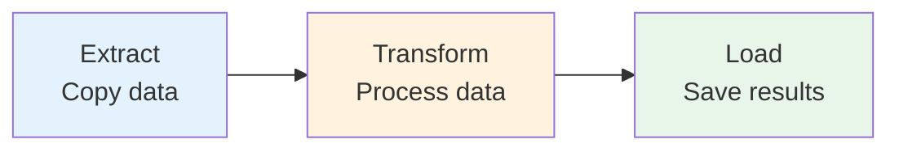

| Step | What it does | Our folder |
|------|--------------|------------|
| **Extract** | Copy data from production databases to staging area | `src/extract/` |
| **Transform** | Process data: combine, clean, summarize | `src/transform/` |
| **Load** | Save processed data to destination tables | `src/load/` |

The `src/shared/` folder contains utilities used by all three steps.

---

## Folder Responsibilities

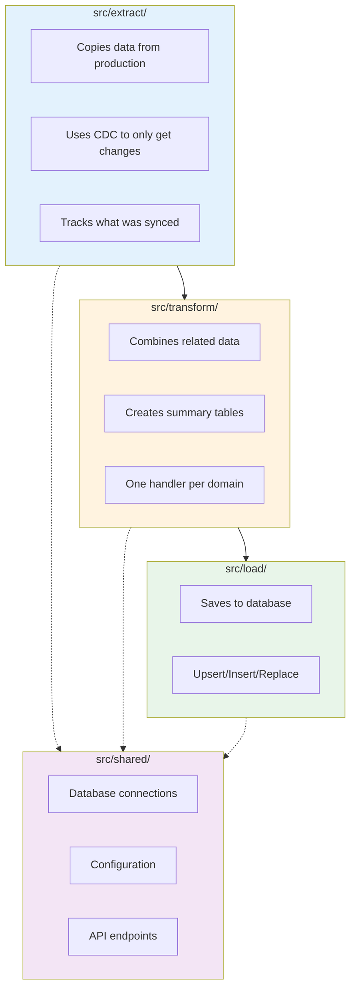

| Folder | Responsibility | Key Files |
|--------|----------------|-----------|
| `src/extract/` | Copy data from production to staging | `worker.py`, `loop.py`, `query_builder.py` |
| `src/transform/` | Process data, create summaries | `handler.py`, `transforms/*.py` |
| `src/load/` | Save data to database | `loader.py` |
| `src/shared/` | Common utilities | `config.py`, `connections.py`, `api/` |

---

## What This System Does

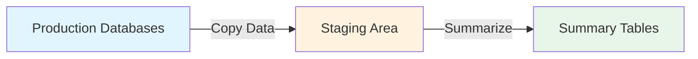

**In simple terms:**
1. We **copy** data from 5 production databases into a staging area
2. We **combine** related data into one place (denormalization)
3. We **summarize** the data into easy-to-read reports

---

## The Big Picture

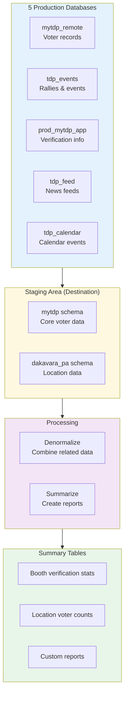

---

## Step-by-Step Flow

### Step 1: Copy Data (Extract)

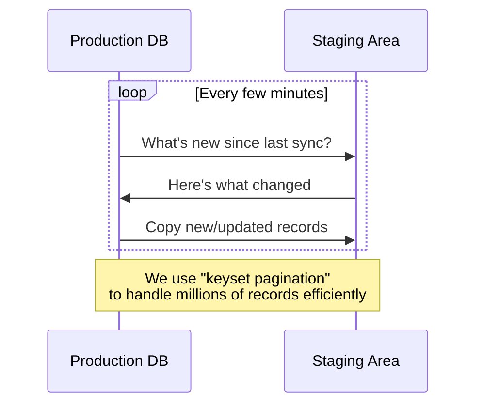

**What happens:**
- We check each production database for new or updated records
- We copy only what changed (not the entire database)
- This happens automatically every few minutes

### Step 2: Combine Data (Denormalize)

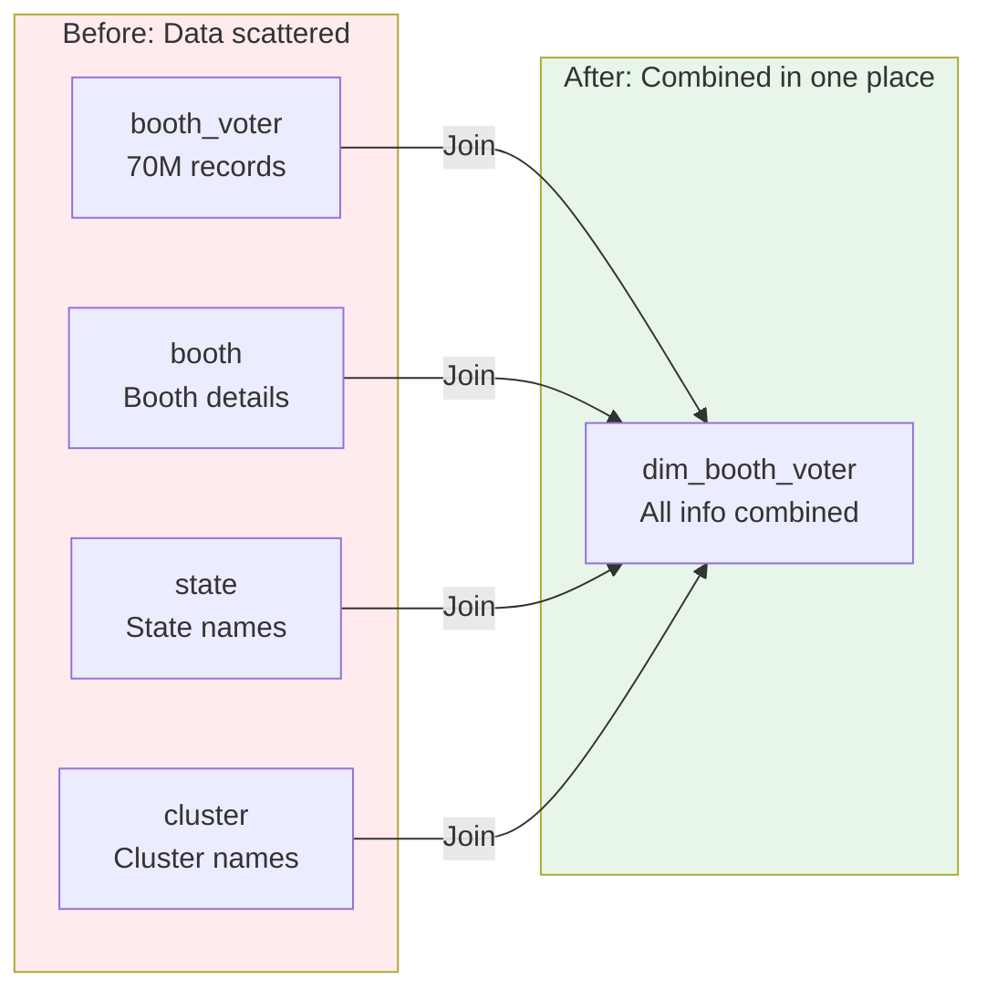

**Why we do this:**
- `booth_voter` has 70 million records
- If we join it with other tables multiple times, it's slow
- We combine everything ONCE into `dim_booth_voter`
- Then all reports read from this combined table (fast!)

### Step 3: Create Reports (Summarize)

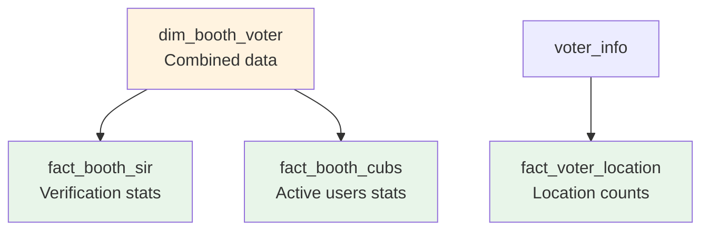

**What we create:**
- **Booth verification stats**: How many voters verified per booth
- **Active user stats**: Who's actively using the system
- **Location counts**: How many voters in each area

---

## Key Concepts

### What is CDC?

**CDC (Change Data Capture)** = Only copying what changed

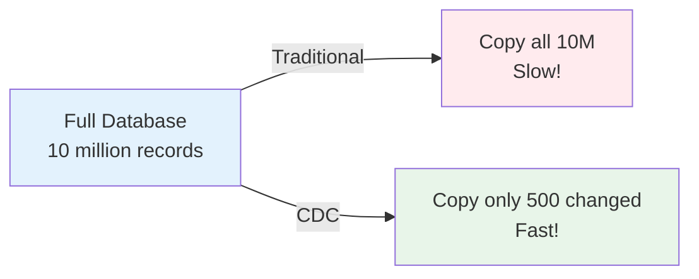

### Why Micro-Batching?

We process data in small batches (500 records at a time) instead of all at once:

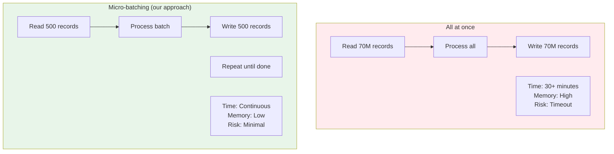

**Why we chose micro-batching:**

| Problem | All-at-once | Micro-batching |
|---------|-------------|----------------|
| Memory | Loads entire table into memory | Only 500 records at a time |
| Timeout | Risk of long-running queries | Each batch completes quickly |
| Failure | Restart from beginning | Resume from last batch |
| Blocking | Locks tables for extended time | Minimal locking |
| Progress | No visibility until done | Real-time progress updates |

**Example:**
```sql
-- Keyset pagination: efficient for large tables
SELECT * FROM booth_voter
WHERE (updated_at > '2026-07-15' OR (updated_at = '2026-07-15' AND id > 'BV00300'))
ORDER BY updated_at, id
LIMIT 500
```

### What is Denormalization?

**Denormalization** = Combining related data into one table

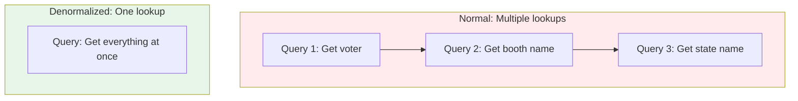

### What is a Fact Table?

**Fact Table** = A summary table with numbers/metrics

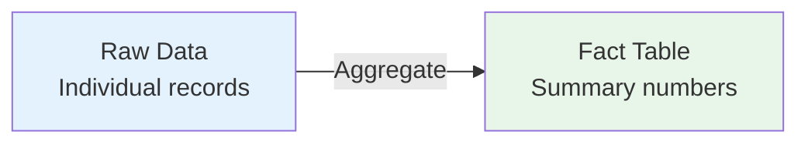

**Example:**
- Raw data: "Voter 1 verified", "Voter 2 verified", "Voter 3 not verified"
- Fact table: "2 voters verified, 1 not verified"

---

## Database Structure

### Source Databases (Production)

| Database | What it contains | Example |
|----------|------------------|---------|
| mytdp_remote | Voter records | 70M voter entries |
| tdp_events | Events & rallies | Rally attendance |
| prod_mytdp_app | Verification data | SIR verification status |
| tdp_feed | News feeds | Feed updates |
| tdp_calendar | Calendar events | Event schedules |

### Destination Database (Staging)

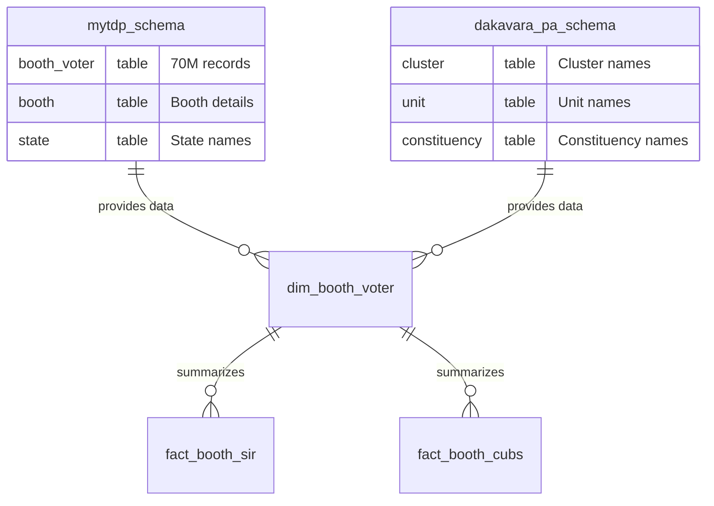

---

## Why This Design?

### Problem: Slow Queries

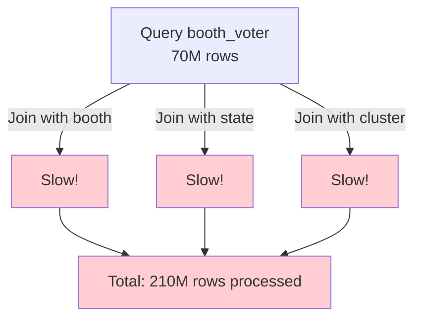

### Solution: Denormalize Once

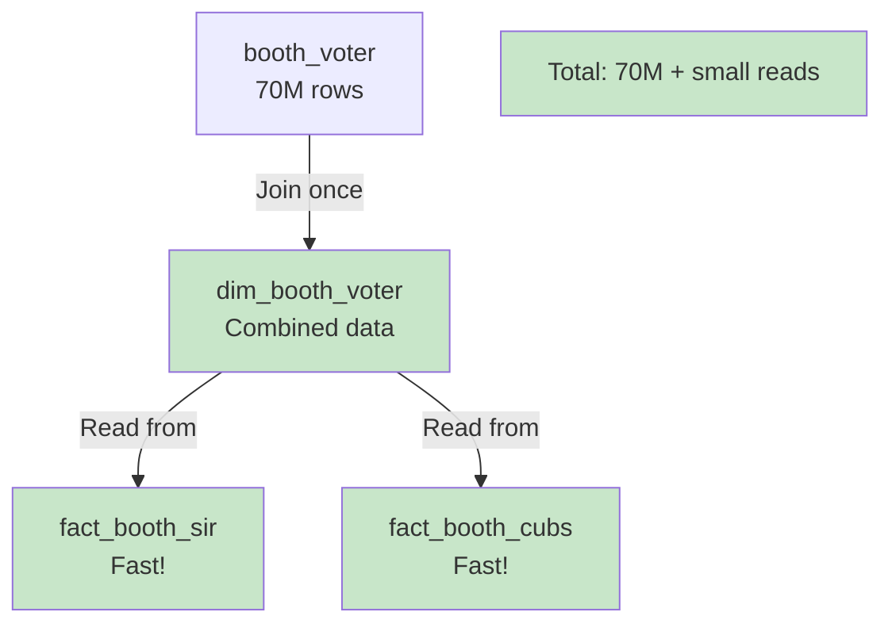

---

## Navigation

- **[Home](../README.md)** — Back to main README
- **[SIR Domain](SIR_DOMAIN.md)** — See how SIR verification works
- **[Adding Transforms](ADDING_TRANSFORMS.md)** — How to add new features
- **[Technical Details](TECHNICAL.md)** — Deep dive for developers
