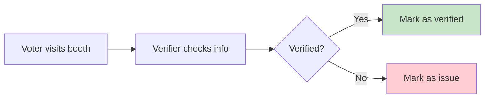
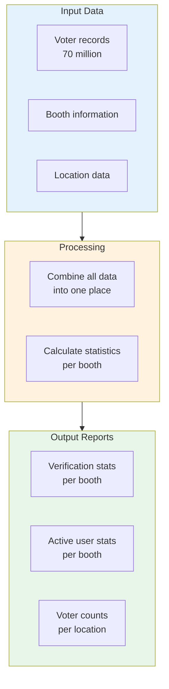
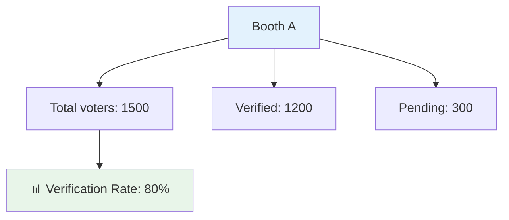
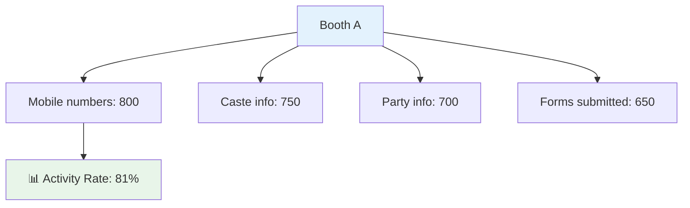
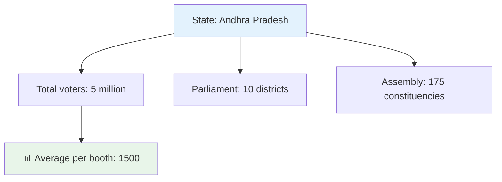
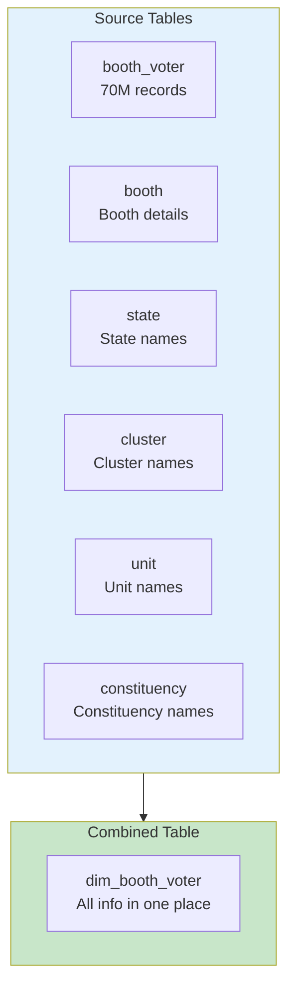
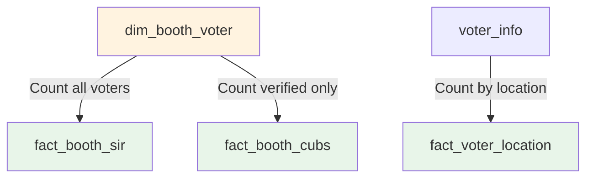
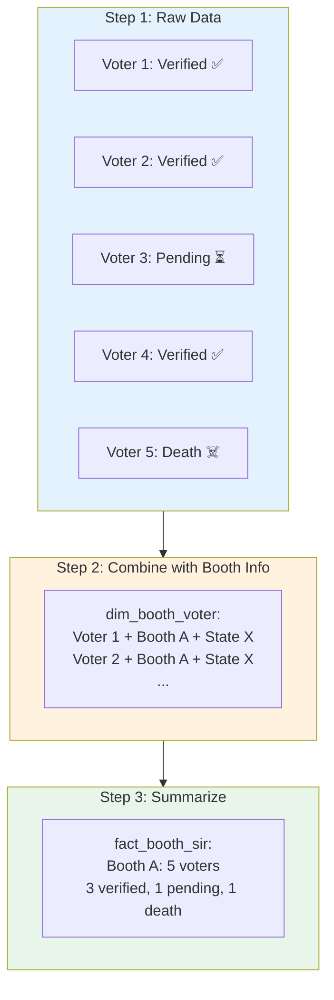
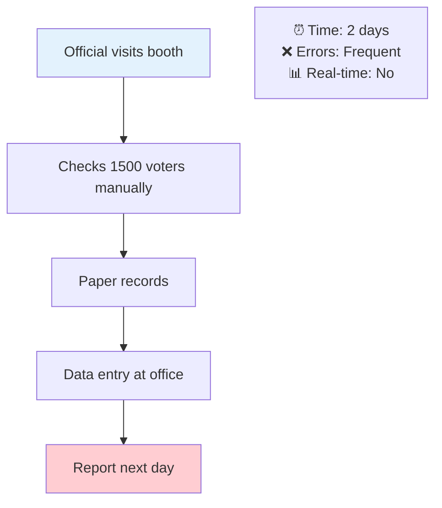
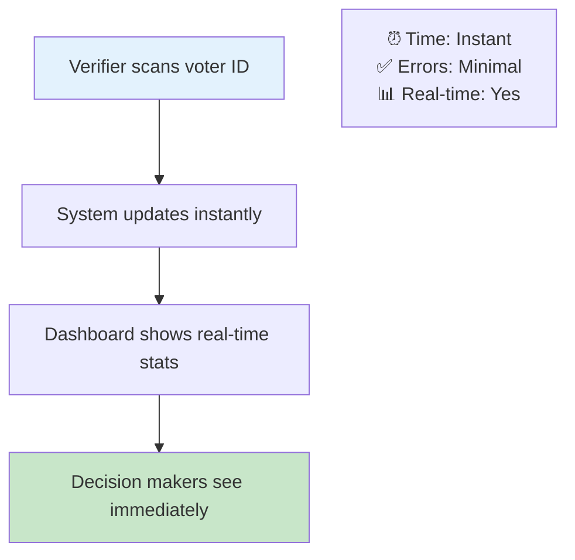

# SIR Domain — Voter Verification Tracking

> **For non-technical readers:** This document explains how we track voter verification status using simple language and visual diagrams.

## What is SIR?

**SIR (Systematic Voters' Education and Electoral Participation)** is a system to verify voter information across polling booths.

---

## What This System Does

---

## The Three Reports

### 1. Booth Verification Stats (`fact_booth_sir`)

Shows verification status for each polling booth.

**What it tells us:**
- How many voters in each booth
- How many have been verified
- How many are still pending

### 2. Active User Stats (`fact_booth_cubs`)

Shows who's actively using the system.

**What it tells us:**
- How many voters have mobile numbers recorded
- How many have caste/party information
- How many forms have been submitted

### 3. Location Voter Counts (`fact_voter_location`)

Shows voter distribution across locations.

**What it tells us:**
- How many voters in each state
- How many in each parliament/assembly area
- Distribution across locations

---

## How Data Flows

### Step 1: Combine Data (Denormalize)

**Why?** Because joining 70M records multiple times is slow. We do it once!

### Step 2: Create Reports

---

## Example: Booth A Verification

---

## Key Metrics Explained

### Verification Status

| Status | Meaning | Example |
|--------|---------|---------|
| ✅ Available | Voter is present and verified | "Yes, I'm here" |
| 🔄 Temporary shift | Voter temporarily moved | "I'm at different booth" |
| 🏠 Permanent shift | Voter permanently moved | "I moved to new address" |
| ☠️ Death | Voter has passed away | — |
| 👥 Duplicate | Multiple records for same voter | — |
| 🔄 Double vote | Voter voted in multiple places | — |

### Activity Metrics

| Metric | What it measures |
|--------|------------------|
| Mobile numbers | How many voters have phone numbers recorded |
| Caste info | How many have caste/category information |
| Party info | How many have political party affiliation |
| Forms submitted | How many physical forms have been submitted |

---

## Real-World Example

### Before System

### After System

---

## Navigation

- **[Home](../README.md)** — Back to main README
- **[Architecture](ARCHITECTURE.md)** — How the system works
- **[Adding Transforms](ADDING_TRANSFORMS.md)** — How to add new features
- **[Technical Details](TECHNICAL.md)** — Deep dive for developers
