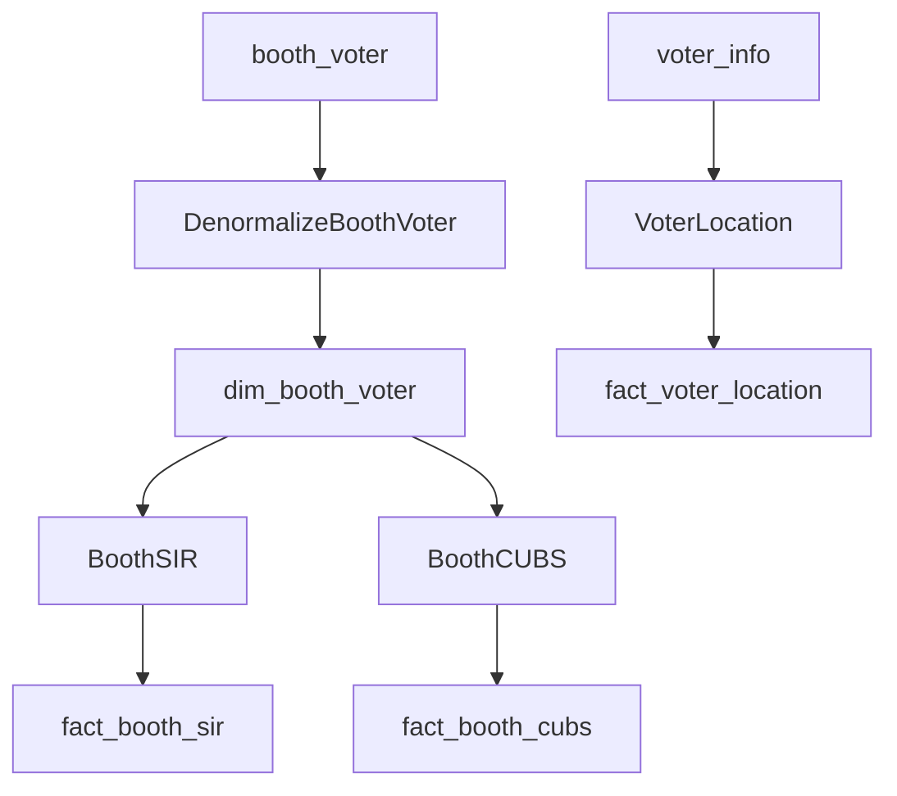

# Technical Details

## Directory Structure

```
src/
├── extract/              # CDC extraction layer
│   ├── worker.py         # Main extraction logic
│   ├── query_builder.py  # SQL query generation
│   ├── batch_writer.py   # Bulk INSERT/UPDATE
│   ├── loop.py           # Continuous extraction loop
│   ├── retry.py          # Error handling
│   ├── history.py        # Sync history tracking
│   ├── status.py         # Sync status management
│   └── logger.py         # Logging utilities
├── transform/            # Transform layer
│   ├── base.py           # TransformHandler + TransformHelper
│   ├── registry.py       # Auto-discovers handlers
│   ├── orchestrator.py   # Dependency dispatch
│   ├── dependencies.py   # Dependency resolution
│   └── sir/              # SIR domain
│       ├── handler.py    # Orchestrator
│       └── transforms/   # Individual transforms
│           ├── denormalize.py
│           ├── booth_sir.py
│           ├── booth_cubs.py
│           └── voter_location.py
├── load/                 # Load strategies
│   ├── base.py           # Base loader
│   └── upsert/           # Upsert loader
│       └── loader.py
├── shared/               # Shared utilities
│   ├── config.py         # YAML config loader
│   ├── connections.py    # Connection pool management
│   ├── interfaces.py     # Database/Cursor protocols
│   ├── mode.py           # Mode detection (local/prod)
│   └── repositories.py   # TableConfig, Watermark repos
└── sync/                 # Legacy sync engine (being phased out)
```

---

## Transform Architecture

### Handler Pattern

```python
# handler.py — Orchestrator (NO SQL)

class Handler(TransformHandler):
    @property
    def name(self) -> str:
        return "sir"

    @property
    def depends_on(self) -> List[str]:
        return ["booth_voter", "booth", "state"]

    @property
    def outputs(self) -> List[str]:
        return ["dim_booth_voter", "fact_booth_sir"]

    def transform(self, source_db, dest_db, params):
        transforms = [
            ("dim_booth_voter", DenormalizeBoothVoter()),
            ("fact_booth_sir", BoothSIR()),
        ]
        for name, transform in transforms:
            rows = transform.run(dest_db, from_date, to_date, ...)
```

### Transform Pattern

```python
# transforms/booth_sir.py — Individual transform (HAS SQL)

TABLE = "fact_booth_sir"
DEPENDS_ON = ["dim_booth_voter"]

class BoothSIR(TransformHelper):
    def run(self, db, from_date, to_date, report_date, publication_date_id):
        sql = """
            SELECT booth_id, state_id, COUNT(*) ...
            FROM dim_booth_voter
            WHERE DATE(updated_at) BETWEEN %s AND %s
            GROUP BY booth_id, state_id
        """
        rows = self.fetch(db, sql, (from_date, to_date))
        upsert = self.make_upsert(TABLE, columns, pk="booth_id,report_date")
        self.write(db, upsert, params_list)
        return len(rows)
```

---

## Keyset Pagination

```sql
-- Cursor-based pagination for large tables
SELECT * FROM booth_voter
WHERE (updated_at > '2026-07-15' 
   OR (updated_at = '2026-07-15' AND id > 'BV00300'))
ORDER BY updated_at, id
LIMIT 500
```

**Benefits:**
- Consistent performance regardless of offset
- Handles concurrent writes gracefully
- Memory efficient

---

## Dependency Resolution



**Resolution order:**
1. Extract tables (booth_voter, booth, state, etc.)
2. Denormalize (dim_booth_voter)
3. Aggregate (fact_booth_sir, fact_booth_cubs)
4. Separate paths (fact_voter_location)

---

## TransformHelper Methods

### `fetch(db, sql, params)`

```python
rows = self.fetch(db, "SELECT id, name FROM state WHERE id = %s", (1,))
# Returns: [{'id': 1, 'name': 'Andhra Pradesh'}]
```

### `write(db, sql, params_list)`

```python
self.write(db, "INSERT INTO t VALUES (%s,%s) ON DUPLICATE KEY UPDATE b=VALUES(b)", 
           [(1,'x'), (2,'y')])
```

### `make_upsert(table, columns, pk)`

```python
upsert = self.make_upsert(
    "fact_booth_sir",
    columns=["booth_id", "state_id", "total_voters", "report_date"],
    pk="booth_id,report_date"
)
# Returns: INSERT INTO fact_booth_sir (...) VALUES (...)
#          ON DUPLICATE KEY UPDATE state_id=VALUES(state_id), ...
```

---

## Database Connections

```python
# Connection pooling
factory = PooledDatabaseFactory()
db = factory.get_or_create('dest', config)

# Cursor operations
cur = db.cursor()
cur.execute(sql, params)
rows = cur.fetchall()
db.commit()
```

---

## Migration Structure

```
migrations/
├── prod/                 # Production schemas
│   ├── 001_sync_tables.sql
│   └── sir/
│       └── 001_summary.sql
└── local/                # Development
    ├── 001_test_schema.sql
    ├── 002_source_seed.sql
    ├── 003_dakavara_pa_seed.sql
    ├── 004_extract_configs.sql
    ├── 005_fix_columns_json.sql
    └── 006_dest_staging.sql
```

---

## Configuration

### config.yaml

```yaml
sources:
  local:
    host: localhost
    port: 3308
    database: mytdp
  dakavara_pa:
    host: localhost
    port: 3308
    database: dakavara_pa

destination:
  local:
    host: localhost
    port: 3307
    database: mytdp
```

### sync_config (Database)

```sql
INSERT INTO sync_config (table_name, source_name, columns_json, ...)
VALUES ('booth_voter', 'local', '["id","booth_id","voter_id",...]', ...);
```

---

## Error Handling

```python
# Retry logic
@retry(max_attempts=3, delay=1)
def extract_table(config):
    # Extraction logic
    pass

# Transform error handling
for table_name, transform in transforms:
    try:
        rows = transform.run(db, ...)
    except Exception as e:
        errors.append(f"{table_name}: {e}")
```

---

## Performance Considerations

### Denormalization

```sql
-- ❌ Bad: Join 70M rows multiple times
SELECT ... FROM booth_voter bv
JOIN booth bo ON bv.booth_id = bo.id
JOIN state s ON bo.state_id = s.id
-- Repeated for each summary table

-- ✅ Good: Join once, read from dim
SELECT ... FROM dim_booth_voter
-- Single join, fast reads
```

### Batch Operations

```python
# Bulk insert
params_list = [(r["id"], r["name"]) for r in rows]
self.write(db, upsert_sql, params_list)
```

---

## Navigation

- **[Home](../README.md)** — Back to main README
- **[Architecture](ARCHITECTURE.md)** — System overview
- **[SIR Domain](SIR_DOMAIN.md)** — Voter verification example
- **[Adding Transforms](ADDING_TRANSFORMS.md)** — Developer guide
